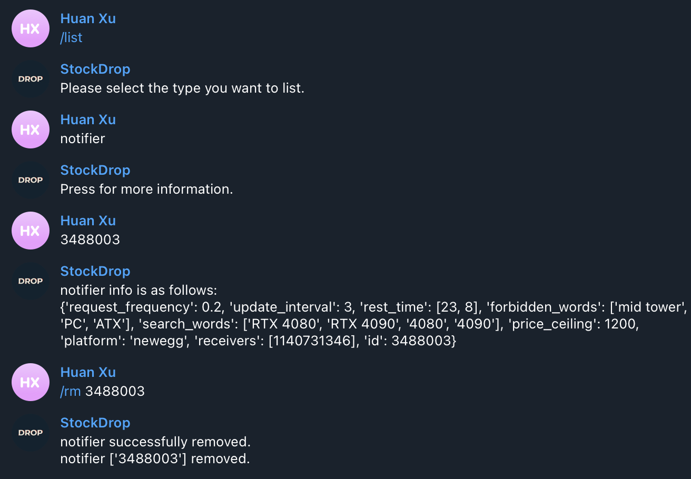

# Stock Drop Notifier

## Index
- [About](#about)
- [Use Case Demo](#use-case-demo)
- [Unique Features](#unique-features)
- [Installation](#installation)
- [Project Architecture](#project-architecture)

## About

Stock Drop Notifier will monitor the stock information for an user-specified product on www.newegg.com and send Telegram message for real time stock update. Users can send Telegram command to customize a search filter, spawn new notifiers, and terminate old notifiers. Simply talk to the Telegram bot [@StockDropBot](https://telegram.me/StockDropBot) to use the service.


## Use Case Demo
Add a notifier to monitor all products on `Newegg` that:
- contain any of the keywords `4080`, `RTX 4080`, `4090`, or `RTX 4090`
- don't contain any of the keywords `mid tower`, `PC`, or `ATX` (exclude PC cases)
- have a price lower than `$1200`

| Use case      | Screenshot |
| ----------- | ----------- |
| Add a notifier to monitor all products on `newegg` that: <ul><li>contain any of the keywords `4080`, `RTX 4080`, `4090`, or `RTX 4090`</li><li>don't contain any of the keywords `mid tower`, `PC`, or `ATX` to exclude PC cases</li><li>have a price lower than `$1200`</li></ul> |  |
| Remove the above-added notifier   |         |
| Receive stock notification about RTX 3080   |         |

## Unique Features
While most other stock informers adopt the naive approach of checking the "add to cart" keyword from webpage, our notifier used a tailored newegg parser to locate the price, dealer, and stock information for an product, which enables more complex search filters and higher information accuracy. 

Moreover, our notifier automated the process of manually entering product urls to check on. All you need to do is to give some search words, and the notifier will automatically find product urls based on them.


Finally, features of Stock Drop Notifier can be accessed through a Telegram bot. See [command.md](command.md) for details. 

## Installation
*Note: you don't need to host Stock Drop Notifier to use it. Simply talk to the Telegram bot [@StockDropBot](https://telegram.me/StockDropBot) to use the service.*

To host Stock Drop Notifier, follow the steps below. Hosting requires a Unix-like system with Python 3.6+ installed:
1. run the following commands to set up the run time environment. 
 ```
    git clone https://github.com/hxu296/stock-drop-notifier.git
    cd stock-drop-notifier
    git checkout stable
    pip3 install -r requirements.txt
    pip3 install python-telegram-bot --upgrade
```
2. receive your telegram bot token from [@BotFather](https://telegram.me/BotFather).
3. run `python3 run.py -m` from the project root directory and paste your bot token according to the instruction.
4. talk to your Telegram bot using commands from [command.md](command.md).


## Project Architecture


