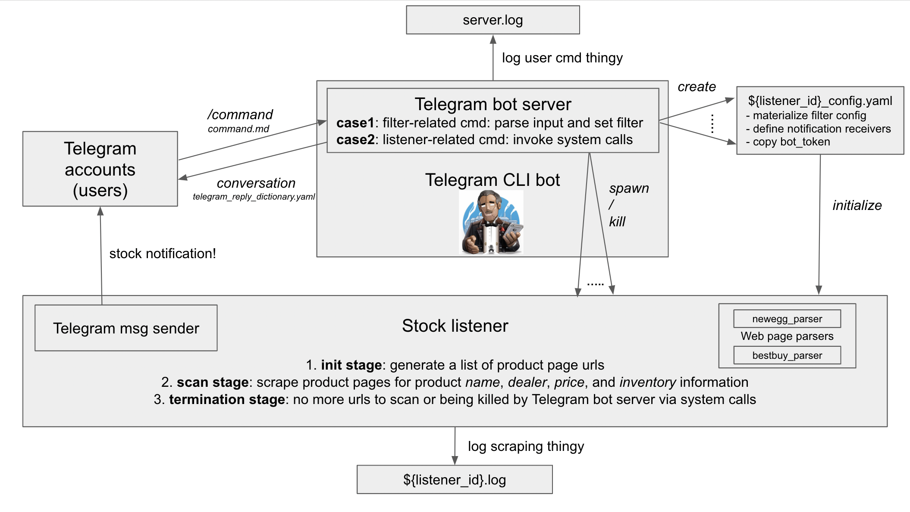

# Stock Drop Notifier

## Quick Start
This project is still at the early stage of development. To run it as it is, you need to do the following:
1. run the following commands to set up the run time environment. 
 ```
    git clone https://github.com/hxu296/stock-drop-notifier.git
    cd stock-drop-notifier
    git checkout stable
    pip3 install -r requirements.txt
    pip3 install python-telegram-bot --upgrade
```
2. receive your telegram bot token from BotFather.
3. run `python3 run.py -m` from the project root directory and paste your bot token according to the instruction.
4. talk to your Telegram bot using commands from [command.md](command.md)

## About

Stock Drop Notifier will monitor the stock information for an user-specified product on www.newegg.com and send Telegram message for real time stock update. 

Users can send Telegram command to customize a search filter, spawn new notifiers, and terminate old notifiers.

## Unique Features

While most other stock informers adopt the naive approach of checking the "add to cart" keyword from webpage, our notifier used a tailored newegg parser to locate the price, dealer, and stock information for an product, which enables more complex search filters and higher information accuracy. 

Moreover, our notifier automated the process of manually entering product urls to check on. All you need to do is to give some search words, and the notifier will automatically find product urls based on them.


Finally, features of Stock Drop Notifier can be accessed through a Telegram bot. See [command.md](command.md) for details. 


## Project Architecture



